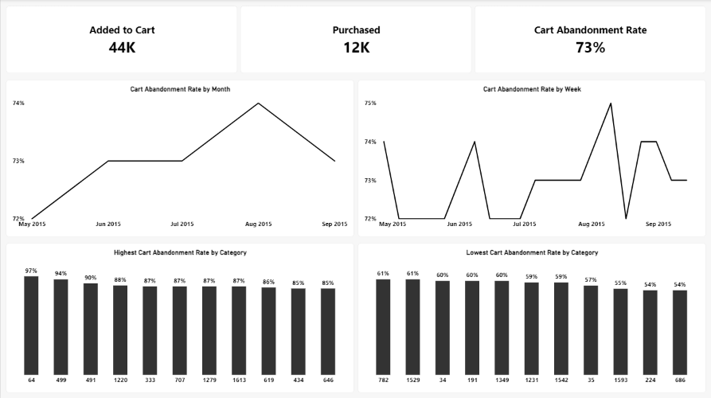

# Cart Abandonment Analysis — Retail Rocket Dataset

## Overview
A funnel analysis measuring cart abandonment rate using real session-level event data (views, cart additions, purchases) from the [Retail Rocket e-commerce dataset](https://www.kaggle.com/datasets/retailrocket/ecommerce-dataset) on Kaggle. This project reconstructs user sessions from raw event logs, then calculates and segments cart abandonment rate to identify where and when drop-off happens.

**Tools used:** DuckDB, SQL, Power BI

## Dataset
- **events.csv** — 2,756,101 events (2,664,312 views, 69,332 add-to-carts, 22,457 transactions) from 1.4M+ visitors over 4.5 months
- **item_properties_part1/2.csv** — 20,275,902 rows of time-varying item metadata (category, availability, etc.), hashed for confidentiality
- **category_tree.csv** — category hierarchy

Unlike typical transactional e-commerce datasets (e.g. Olist), Retail Rocket logs raw behavioral events with no pre-built session identifier — session reconstruction was a required first step.



## Methodology

### 1. Session Reconstruction
Retail Rocket provides no `session_id`. Sessions were inferred by:
- Sorting each visitor's events chronologically
- Calculating the time gap between consecutive events
- Marking a new session whenever the gap exceeded **30 minutes** of inactivity (or on a visitor's very first event)

**Why 30 minutes:** rather than assume the industry-standard cutoff, the actual gap distribution was checked first — median gap ~136 seconds (2.3 min), but a sharp cliff to ~75.7 hours at the 90th percentile. This clean separation between "still browsing" and "came back later" confirmed 30 minutes was a reasonable, evidence-based cutoff for this dataset, not an arbitrary default.

### 2. Funnel Construction
Each `(visitor, session)` pair was flagged for whether it contained a view, an add-to-cart, and a transaction. Cart abandonment rate is defined as:

```
Cart Abandonment Rate = 1 − (Sessions with Purchase / Sessions with Add-to-Cart)
```

A session only counts as "converted" if the purchase occurred within the same session as the cart addition — not just any purchase by that visitor.

### 3. Category Attribution
Item categories in this dataset change over time, so each session was matched to the category that was **active at the moment of cart addition** (not just any recorded category for that item), using the first item added to cart per session as the session's representative item.

## Key Findings

| Metric | Result |
|---|---|
| Overall cart abandonment rate | **72.8%** |
| Sessions with cart addition | 43,924 |
| Sessions with purchase (same session) | 11,932 |

**1. Abandonment is stable over time.** Rate held in a ~71.5–75.3% band across the full 4.5-month window, with a mild upward drift (~72% → ~74%) into July/August — worth monitoring, not a dramatic trend.

**2. Abandonment varies far more by category than by time — the strongest finding.** At a loose threshold (≥30 sessions/category), rates ranged from 47% to 97% — a 50-point spread. This held up under a stricter robustness check (≥100 sessions/category): 54% to 97%, a 43-point spread, with several categories (e.g. 707, 1613, 1279) consistent across both thresholds — indicating a genuine category effect rather than small-sample noise.

## Limitations
- Category and item IDs are hashed — no readable product names, so findings are directional (category X vs. category Y) rather than descriptive (e.g. "electronics vs. apparel")
- Session boundary (30 min) is an inferred proxy, not ground truth — Retail Rocket does not log true session starts/ends
- A session is attributed to only its *first* added item; sessions with multiple distinct cart items are simplified to one category

## Dashboard
Power BI dashboard includes: headline KPIs (abandonment rate, carts, purchases), abandonment rate by month and by week, and highest/lowest abandonment categories.
